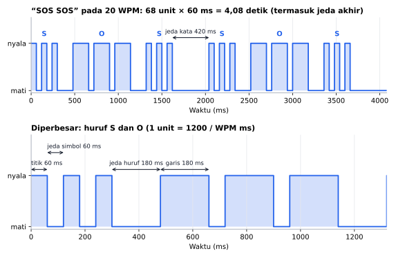
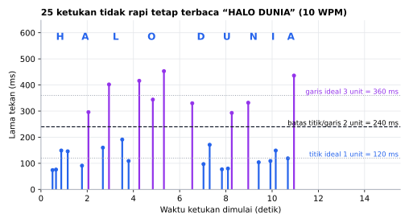

# SandiMorse

[English](README.en.md)

Library Arduino berbahasa Indonesia untuk **sandi Morse**: kirim teks ke LED atau buzzer tanpa `delay()`, terjemahkan teks ⇄ Morse, dan ubah ketukan tombol menjadi huruf.

```cpp
morse.kirim("SOS");                          // LED/buzzer berbunyi, loop() tetap jalan
ubahKeMorse("SOS", hasil);                   // "... --- ..."
if (pembaca.perbarui(ditekan)) Serial.print(pembaca.huruf());
```

## Fitur

- **Pengirim non-blocking**: `loop()` tetap jalan selama Morse dikirim. Tanpa `delay()`.
- **Kecepatan dalam WPM** dengan timing standar PARIS: 1 unit = 1200 / WPM ms. Titik 1 unit, garis 3, jeda antarsimbol 1, antarhuruf 3, antarkata 7.
- **Ke pin langsung atau tanpa pin**: baca `nyala()` lalu kendalikan sendiri `tone()`, relay, LED RGB, atau layar.
- **Penerjemah** teks → Morse dan Morse → teks dengan buffer tetap. `false` jika buffer tidak muat.
- **Pembaca ketukan tombol**: membedakan titik/garis dan jeda huruf/kata berdasarkan WPM, dengan toleransi ±1 unit dan debounce.
- **54 karakter**: A–Z, 0–9, dan `. , ? ' ! / ( ) & : ; = + - _ " $ @`. Tabel hanya 63 byte, disimpan di flash (PROGMEM).
- **Hemat RAM**: 13 byte per pengirim, 11 byte per pembaca (Arduino Uno). Tanpa `String` dan tanpa alokasi dinamis.
- Aman saat `millis()` meluap (setelah ±49 hari menyala).

## Board yang didukung

| Board | Teruji compile |
|---|---|
| Arduino Uno / Nano | ✅ |
| Arduino Mega | ✅ |
| ESP32 DevKit | ✅ |
| ESP32-C3 / S3 | ✅ |
| STM32 Blackpill F411 | ✅ |
| STM32 Bluepill F103 | ✅ |

STM32 memakai core resmi **STM32duino** (STMicroelectronics). Library ini hanya memakai `digitalWrite()` dan `millis()`, jadi seharusnya bekerja di board Arduino lain juga.

## Instalasi

**Library Manager:** Arduino IDE → *Sketch → Include Library → Manage Libraries…* → cari **SandiMorse** → *Install*.

**Manual:** unduh ZIP dari GitHub → *Sketch → Include Library → Add .ZIP Library…*

## Contoh cepat

```cpp
#include <SandiMorse.h>

SandiMorse morse(LED_BUILTIN, 15); // LED bawaan, 15 WPM

void setup() {
  morse.mulai();
}

void loop() {
  morse.perbarui();
  if (!morse.sedangMengirim()) morse.kirim("SOS");
}
```

Panggil `perbarui()` di setiap `loop()`. Hindari `delay()` panjang di `loop()`, karena status LED hanya berubah saat `perbarui()` dipanggil.

Teks yang dikirim **tidak disalin**, jadi harus tetap ada selama dikirim: string literal (`"SOS"`) atau array global. Jangan kirim array lokal yang hilang saat fungsi selesai.

## Hasil simulasi

Grafik dan keluaran di bawah adalah **simulasi** di PC yang menjalankan kode library ini dengan `millis()` tiruan, bukan pengukuran hardware.



Keluaran `nyala()` saat mengirim `"SOS SOS"` pada 20 WPM, dibaca setiap 1 ms. Titik 60 ms, garis 180 ms, jeda simbol 60 ms, jeda huruf 180 ms, dan jeda kata 420 ms tepat sesuai timing PARIS. Satu kiriman selesai dalam 4,08 detik termasuk jeda 7 unit di akhir.



`PembacaMorse` pada 10 WPM menerima ketukan "HALO DUNIA" yang sengaja dibuat tidak rapi (acak dengan seed tetap): titik 74–191 ms, garis 293–453 ms, jeda juga acak. Semua ketukan berada di sisi yang benar dari batas 2 unit, jadi seluruh huruf terbaca tepat.

Contoh penerjemah teks ⇄ Morse (keluaran program simulasi):

```
ubahKeMorse("SOS") -> "... --- ..."
ubahKeMorse("Halo Dunia") -> ".... .- .-.. --- / -.. ..- -. .. .-"
ubahKeMorse("Jam 07:30, OK?") -> ".--- .- -- / ----- --... ---... ...-- ----- --..-- / --- -.- ..--.."
ubahKeTeks("... --- ...") -> "SOS"
ubahKeTeks(".- .-. -.. ..- .. -. --- / ..---") -> "ARDUINO 2"
ubahKeTeks("-- --- .-. ... . / ........") -> "MORSE *"
```

Huruf kecil diperlakukan sama dengan huruf besar, dan kode yang tidak ada di tabel (`........`) menjadi `*`.

Grafik dibuat dari simulasi di PC yang menjalankan kode library ini (`extras/simulasi`):
```sh
cd extras/simulasi
python gambar.py   # butuh g++ dan matplotlib
```

## Kecepatan & memori

Diukur dengan simavr (simulator ATmega328P yang akurat per siklus) di Arduino Uno 16 MHz. Pengirim: 20 WPM, kirim `"SOS"` ke pin 13, sketch yang sama untuk semua library; `perbarui()` diukur di tengah satu titik/garis (jalur yang paling sering).

| Pengirim | SandiMorse 1.0.0 | Etherkit Morse 1.1.2 | MorseEncoder 2.0.3 |
|---|---|---|---|
| Satu panggilan update | 105 siklus (7 µs) | 226 (14 µs), wajib tepat tiap 1 ms | - (memblokir) |
| Lama program berhenti saat kirim `"SOS"` | 0 | 0 | 1.801 ms |
| RAM per objek | 13 B | 141 B | 12 B |
| Flash tambahan | 602 B | 1.644 B | 2.680 B |

Fungsi lain (sketch `extras/benchmark`):

| | Siklus | Kompleksitas |
|---|---|---|
| `PembacaMorse::perbarui()` tombol dilepas / ditekan | 104 / 120 (7 µs) | O(1) |
| `ubahKeMorse("SOS KU")` | 2.264 (141 µs) | O(panjang teks) |
| `ubahKeTeks("... --- ... / -.- ..-")` | 4.954 (310 µs) | O(panjang × 63) |

`SandiMorse::perbarui()` O(1) waktu dan memori. `ubahKeTeks()` mencari tiap kode di tabel 63 byte (±600 siklus per huruf); tabel kebalikan akan lebih cepat tetapi menambah flash, padahal fungsi ini dipanggil sesekali, jadi sengaja tidak dibuat. Pembaca ketukan SimpleMorse tidak diukur: `update()`-nya memanggil `delay(50)`.

Mengulang pengukuran: sketch `extras/benchmark/SandiMorseBenchmark` (butuh simavr).

## Buzzer pasif dengan `tone()`

Buzzer pasif butuh `tone()`, jadi pakai mode tanpa pin dan panggil `tone()` hanya saat status berubah:

```cpp
SandiMorse morse; // tanpa pin

void loop() {
  static bool bunyi = false;
  if (morse.perbarui() != bunyi) {
    bunyi = morse.nyala();
    if (bunyi) tone(8, 700);
    else noTone(8);
  }
}
```

Buzzer aktif (berbunyi sendiri saat diberi HIGH) cukup `SandiMorse morse(8);` seperti LED.

## Membaca ketukan tombol

`PembacaMorse` menerima status tombol, jadi bisa dipakai dengan pin apa pun, modul sentuh, atau TombolPintar:

```cpp
PembacaMorse pembaca(10); // 10 WPM: titik 120 ms, garis 360 ms

void loop() {
  bool ditekan = digitalRead(2) == LOW;
  if (pembaca.perbarui(ditekan)) Serial.print(pembaca.huruf());
}
```

| Kejadian | Batas | Pada 10 WPM |
|---|---|---|
| Tekan → titik | < 2 unit | < 240 ms |
| Tekan → garis | ≥ 2 unit | ≥ 240 ms |
| Lepas → huruf selesai | ≥ 2 unit | ≥ 240 ms |
| Lepas → spasi | ≥ 5 unit | ≥ 600 ms |

Batasnya di tengah antara nilai standar (1 dan 3 unit, 3 dan 7 unit), jadi ketukan boleh meleset ±1 unit. Huruf langsung muncul saat jeda huruf tercapai, tidak menunggu ketukan berikutnya. Getaran kontak di bawah 1/4 unit diabaikan. Pemula biasanya nyaman di 5–10 WPM.

## Referensi fungsi

### Pengirim `SandiMorse`

| Fungsi | Keterangan |
|---|---|
| `SandiMorse(uint8_t pin, uint8_t wpm = 20)` | LED atau buzzer aktif di pin, HIGH saat berbunyi. |
| `SandiMorse()` | Tanpa pin, baca `nyala()`. 20 WPM. |
| `void mulai()` | Panggil di `setup()`. Mengatur pin sebagai OUTPUT. |
| `bool kirim(const char *teks)` | Mulai mengirim, menggantikan kiriman sebelumnya. `false` jika tidak ada karakter yang bisa dikirim. |
| `bool perbarui()` | Panggil di setiap `loop()`. Mengembalikan `nyala()`. |
| `bool nyala()` | `true` saat titik/garis berbunyi. |
| `bool sedangMengirim()` | `true` sampai jeda 7 unit setelah huruf terakhir selesai. |
| `void berhenti()` | Hentikan kiriman dan matikan keluaran. |
| `void aturWPM(uint8_t wpm)` | Kecepatan, default 20. |
| `uint16_t durasiUnit()` | Lama 1 unit (ms). |

Huruf kecil dikirim sebagai huruf besar. Spasi, tab, dan baris baru menjadi jeda kata. Karakter yang tidak ada di tabel dilewati.

### Pembaca `PembacaMorse`

| Fungsi | Keterangan |
|---|---|
| `PembacaMorse(uint8_t wpm = 10)` | Pembaca dengan kecepatan ketukan yang diharapkan. |
| `bool perbarui(bool ditekan)` | Panggil di setiap `loop()`. `true` jika ada huruf baru. |
| `bool hurufBaru()` | Sama dengan hasil `perbarui()` terakhir. |
| `char huruf()` | Huruf terakhir. `' '` untuk jeda kata, `'*'` (`TIDAK_DIKENAL`) jika kodenya tidak ada di tabel. |
| `void aturWPM(uint8_t wpm)` | Kecepatan ketukan. |
| `uint16_t durasiUnit()` | Lama 1 unit (ms). |

### Penerjemah

| Fungsi | Keterangan |
|---|---|
| `bool ubahKeMorse(teks, buffer)` | `"SOS KU"` → `"... --- ... / -.- ..-"`. Huruf dipisah spasi, kata dipisah `" / "`. |
| `bool ubahKeTeks(morse, buffer)` | `"... --- ..."` → `"SOS"`. Kode tidak dikenal menjadi `'*'`. |
| `ubahKeMorse(teks, buffer, ukuran)` | Sama, untuk buffer berupa pointer. |
| `ubahKeTeks(morse, buffer, ukuran)` | Sama, untuk buffer berupa pointer. |

Keduanya mengembalikan `false` jika buffer tidak muat. Isi buffer terpotong tapi selalu diakhiri `'\0'`. Satu huruf Morse paling panjang 7 simbol, jadi siapkan buffer ±7 kali panjang teks.

## Contoh yang tersedia

*File → Examples → SandiMorse*

| Contoh | Isi |
|---|---|
| `KedipSOS` | LED bawaan berkedip SOS terus-menerus. |
| `BuzzerMorse` | Teks dari Serial Monitor dibunyikan di buzzer pasif. |
| `KetukTombolKeTeks` | Ketukan tombol menjadi teks di Serial Monitor. |
| `LatihanMorse` | Huruf acak muncul, pengguna mengetuknya, lalu dinilai benar/salah. |
| `TerjemahSerial` | Teks → Morse dan Morse → teks di Serial Monitor. |

## Dibanding library lain

Ada belasan library Morse di Library Manager. Dibaca dari source code-nya (Oktober 2026):

| Library | Pengirim | Pembaca ketukan | Catatan dari source |
|---|---|---|---|
| **SandiMorse** | ✅ non-blocking | ✅ | Tanpa `delay()` dan `String` |
| MorseEncoder 2.0.3 | ✅ | ❌ | `dot()`/`dash()` memakai `delay()` |
| CWW Morse Transmit 1.2.1 | ✅ | ❌ | `dot()`/`dash()` memakai `delay()` |
| Etherkit Morse 1.1.2 | ✅ non-blocking | ❌ | `update()` harus dipanggil tepat setiap 1 ms (menghitung panggilan, bukan `millis()`) |
| SimpleMorse 1.0.0 | ❌ | ✅ | `update()` memanggil `delay(50)`, tabel dan buffer memakai `String` |

## Pengujian

Tabel lengkap bolak-balik, timing pengirim pada 20 WPM, pembaca dari urutan tekan/lepas buatan, buffer kecil, karakter tidak dikenal, dan luapan `millis()` diuji otomatis di PC (`extras/test`) setiap ada perubahan:

```sh
cd extras/test
g++ -std=c++11 -I. -I../../src uji.cpp ../../src/*.cpp -o uji && ./uji
```

## Status

Versi 1.0.0 sudah lolos uji logika otomatis dan compile di 7 board, tapi **belum diuji di hardware sungguhan**. Jika menemukan masalah, silakan buka *issue* di GitHub.

## Lisensi

MIT © 2026 Amadeo Wisesa. Lihat [LICENSE](LICENSE).
